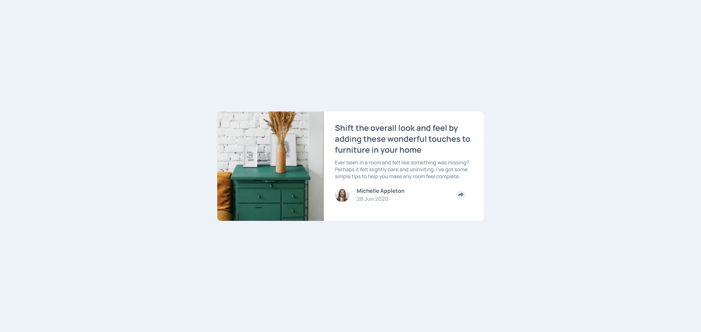

# pablovev - Article preview component solution

### READ THIS

### **Finally the moment came where I was confident that I could understand what I was writing in JS. I'm a beginner developer and it's very difficult to learn something new, leave your comfort zone and take on a new challenge and here I am, taking my first steps in a new programming language. 😊❤️**

This is a solution to the [Article preview component challenge on Frontend Mentor](https://www.frontendmentor.io/challenges/article-preview-component-dYBN_pYFT). Frontend Mentor challenges help you improve your coding skills by building realistic projects. 

### SCREENSHOT

### LINKS

- Solution URL: [Github repositore](https://github.com/Pabloodev/article-preview-component)
- Live Site URL: [URL Site](https://pabloodev.github.io/article-preview-component/)

## My process

### Built with

- Semantic HTML5 markup
- CSS custom properties
- Flexbox
- JavaScript OMG 😭😭😭😭😭😭😭😭😭

### What I learned

As I said, I started to understand my lines of JavaScript code, which made me very happy, I know that what I did is the basics of the basics, but even so, I feel good knowing that I progressed in some way

### Continued development

I intend to continue improving myself in JavaScript and the frontend triad, this is no longer the beginning of a story, it is a continuation, and with that said:

Here, the story of a great developer and IT professional continues

## Author

- Website - [pabloteixeira](https://www.pabloteixeira.site)
- Frontend Mentor - [@pablodev](https://www.frontendmentor.io/profile/Pabloodev)

